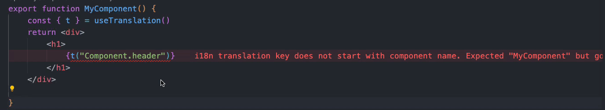

# eslint-plugin-i18n-prefix

ESLint rule that helps verify that i18n translation key starts with matching component name

[](https://badge.fury.io/js/eslint-plugin-i18n-prefix)



## Installation

```bash
pnpm add -D eslint eslint-plugin-eslint-plugin-i18n-prefix
```

## Usage

Add to `.eslintrc`

```json
{
  "extends": ["plugin:eslint-plugin-i18n-prefix/recommended"]
}
```

## Rules

✅ Set in the `recommended` configuration

🔧 Automatically fixable by the [`--fix` CLI option](https://eslint.org/docs/user-guide/command-line-interface#--fix).

| Name                                     | Description                                                      | 💼  | 🔧  |
| :--------------------------------------- | :--------------------------------------------------------------- | :-- | :-- |
| [i18n-prefix](docs/rules/i18n-prefix.md) | Ensure i18n translation key starts with matching component name. | ✅  | 🔧  |

### i18n-prefix

Ensure i18n translation key starts with matching component name

```json
{
	"i18n-prefix/i18n-prefix": [
		"error",
		{
            "translationFunctionName": "t",
            "delimiter": ".",
            "ignorePrefixes": []
		}
	]
}
```

## Notes

This can be used together with https://github.com/natura-cosmeticos/eslint-plugin-i18n-checker
